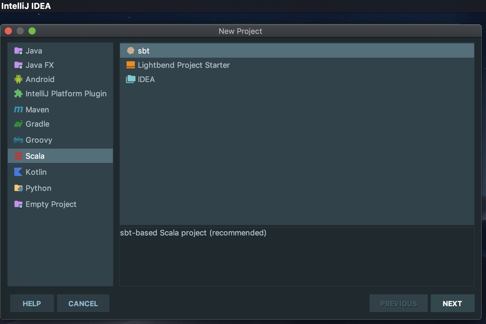
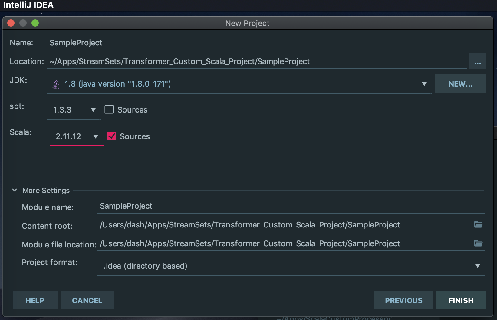
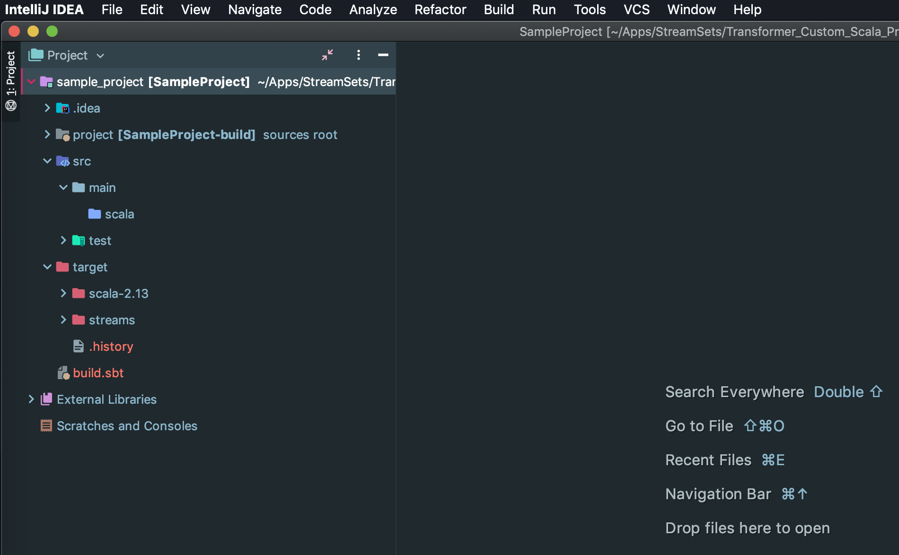
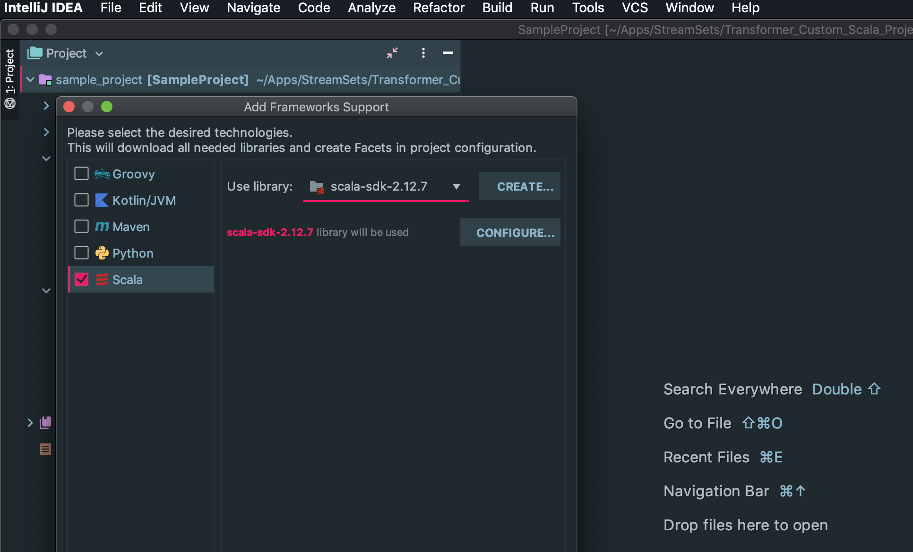
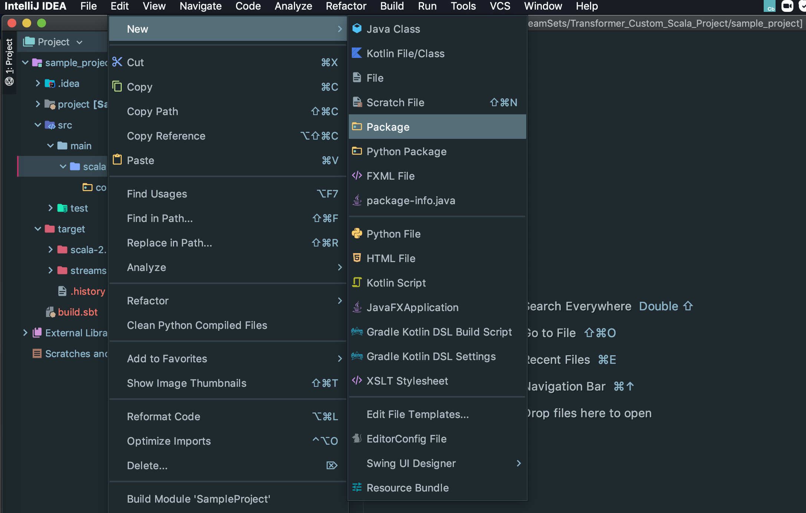
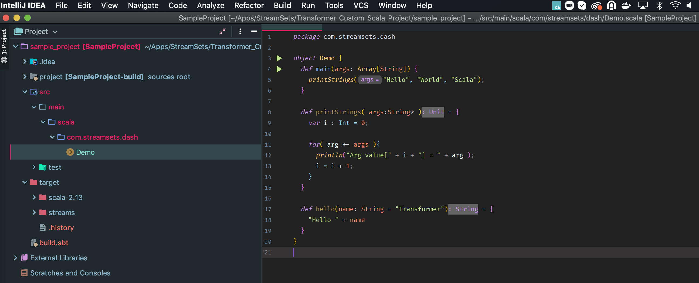
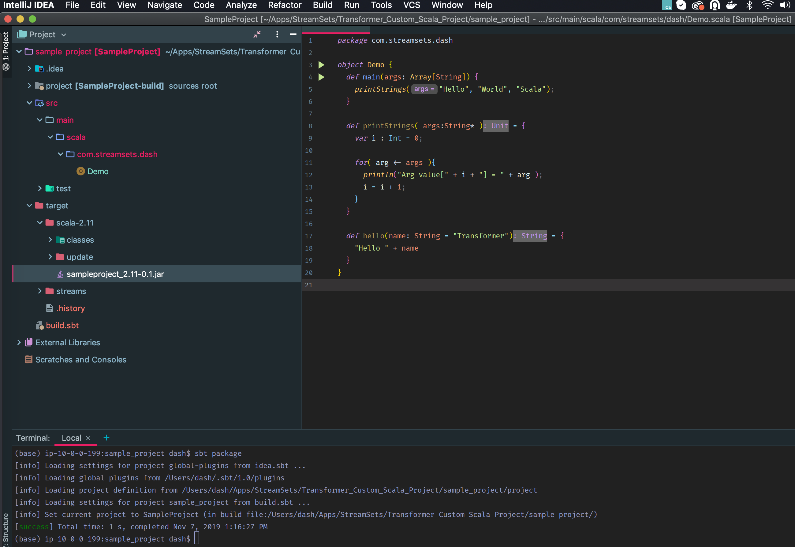
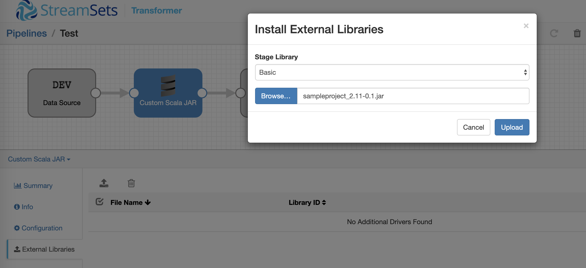
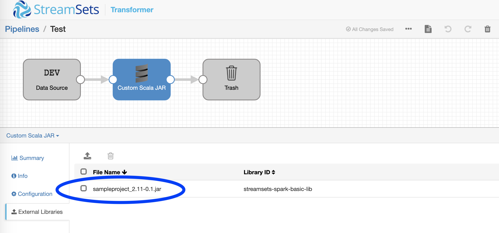
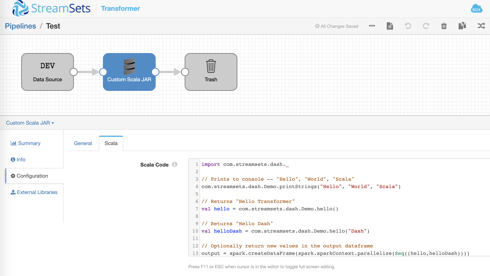

Custom Scala Project for StreamSets Transformer
===============================================

StreamSets Transformer is a powerful tool for creating highly instrumented Apache Spark applications for modern ETL. It is the newest addition to the StreamSets DataOps Platform. With StreamSets Transformer you can quickly start leveraging all the benefits and power of Apache Spark with minimal operational and configuration overhead. It provides enterprises with the flexibility to create ETL pipelines for both batch and streaming data and also gives clear visibility into their data processing operations and performance across both cloud and on-prem systems.

In addition, StreamSets Transformer also enables you to extend its functionality. This tutorial explains how to create a custom Scala project and import the compiled jar into Transformer.

Prerequisites
-------------

* [Download](https://go.streamsets.com/transformer-registration.html) and [install](https://streamsets.com/documentation/controlhub/latest/help/transformer/Installation/Installing.html#concept_es1_hyw_dhb) StreamSets Transformer.
* Oracle [Java Development Kit](http://www.oracle.com/technetwork/java/javase/downloads/index.html) (JDK) 1.8.
* [Scala](https://www.scala-lang.org/download/) version 2.11.12.
* [sbt](https://www.scala-sbt.org/1.x/docs/) to build and package the JAR.
* [IntelliJ](https://www.jetbrains.com/idea/) or similar IDE to build and manage the project.

Note: Transformer includes the Spark libraries required to preview dataflow pipelines. You will need an Apache Spark 2.3 (or higher) distribution to run the pipeline.

Create Scala Project
--------------------

In your favorite IDE, create a new Scala project.



---



Make sure you've selected the right versions for JDK and Scala.

Once the project is successfully created, it should have the following structure.



Next we will need to add support for Scala framework. If you're using IntelliJ, right-click on the project and select **Add Framework Support...** and enable **Scala**.



Now we're ready to create a new package and add our Scala class.




The main Scala object is called **Demo** which implements `main(args: Array[String])`, `printStrings( args:String* )` and `hello(name: String = "Transformer")` methods. Since the focus of this tutorial is to illustrate how to import customer jars written in Scala into Transformer, we'll keep the method implementations to a minimum :)



Here's the implementation:

```scala
package com.streamsets.dash

object Demo {
  def main(args: Array[String]) {
    printStrings("Hello", "World", "Scala");
  }

  def printStrings( args:String* ) = {
    var i : Int = 0;

    for( arg <- args ){
      println("Arg value[" + i + "] = " + arg );
      i = i + 1;
    }
  }

  def hello(name: String = "Transformer") = {
    "Hello " + name
  }
}
```

Now build the project from the project root folder `sbt package`:

```
(base) ip-10-0-0-199:sample_project dash$ sbt package
[info] Loading settings for project global-plugins from idea.sbt ...
[info] Loading global plugins from /Users/dash/.sbt/1.0/plugins
[info] Loading project definition from /Users/dash/Apps/StreamSets/Transformer_Custom_Scala_Project/sample_project/project
[info] Loading settings for project sample_project from build.sbt ...
[info] Set current project to SampleProject (in build file:/Users/dash/Apps/StreamSets/Transformer_Custom_Scala_Project/sample_project/)
[success] Total time: 1 s, completed Nov 7, 2019 1:16:27 PM
```

You should see a jar file `sampleproject_2.11-0.1.jar` in the `target/scala-2.11` directory:



Create StreamSets Transformer Pipeline
--------------------------------------

Since the focus of this tutorial is to illustrate how to import customer jars written in Scala into StreamSets Transformer, we'll keep the pipeline definition itself to a minimum.


1. In the Transformer, click the **Create New Pipeline** button, enter a name and click **Save**.

2. Select Origin > Dev Raw Data Source.

3. Select Processor to connect > Scala.

4. Select Destination to connect > Trash.

5. Select **Scala** processor and click on **External Libraries** in the bottom pane to install `sampleproject_2.11-0.1.jar` under **Basic** Stage Library.





6. Restart Transformer.

7. On **Scala** processor > **Scala** tab, replace exising code with the following code:

```scala
import com.streamsets.dash._

// Prints to console -- "Hello", "World", "Scala"
com.streamsets.dash.Demo.printStrings("Hello", "World", "Scala")

// Returns "Hello Transformer"
val hello = com.streamsets.dash.Demo.hello()

// Returns "Hello Dash"
val helloDash = com.streamsets.dash.Demo.hello("Dash")

// Optionally return new values in the output dataframe
output = spark.createDataFrame(spark.sparkContext.parallelize(Seq((hello,helloDash))))
```

IMP: Note that in this example code, we're ignoring input data and creating a new output dataframe with values returned by calling object methods found in our imported jar.



7. Click on **Preview** and you should see the following output.


Conclusion
----------

It's pretty straightforward to build custom Scala projects and import the jars in StreamSets Transformer, particularly if you already have Apache Spark and Scala development skills.

[The complete sample project can be found here.](sample_project)
